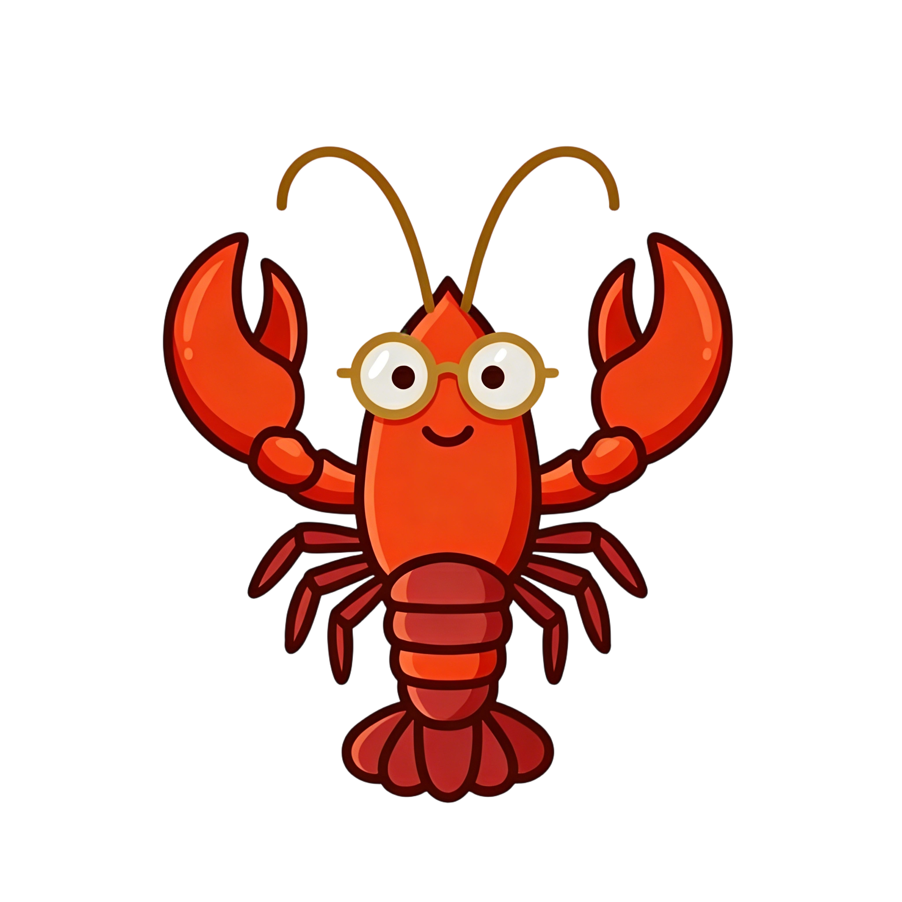
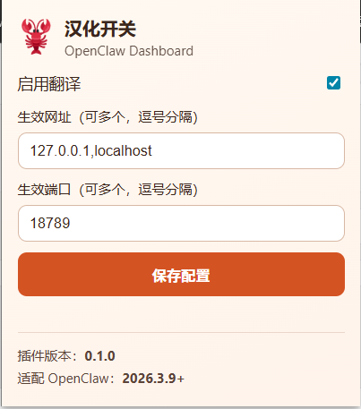
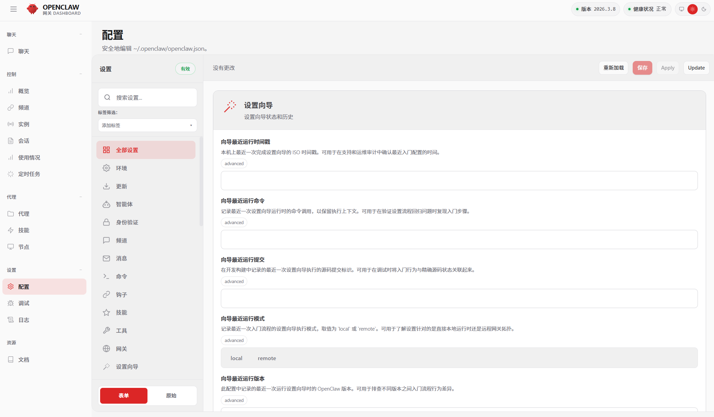

  

# OpenClaw Dashboard Plus

Multilingual userscript and browser extension tooling for OpenClaw Dashboard.

English is the canonical README for this repository.

[English](./README.md) | [简体中文](./docs/readme/README.zh-CN.md) | [繁體中文](./docs/readme/README.zh-TW.md) | [日本語](./docs/readme/README.ja.md) | [한국어](./docs/readme/README.ko.md) | [Français](./docs/readme/README.fr.md) | [Español](./docs/readme/README.es.md) | [Русский](./docs/readme/README.ru.md) | [Deutsch](./docs/readme/README.de.md) | [Tiếng Việt](./docs/readme/README.vi.md) | [Filipino](./docs/readme/README.fil.md) | [العربية](./docs/readme/README.ar.md)

## Overview

OpenClaw Dashboard Plus ships in two forms:

- `openclaw-dashboard-plus.user.js` for userscript managers such as Tampermonkey and ScriptCat
- A browser extension built into `dist/extension/`

The project adds a multilingual content layer, a popup settings panel, remote metadata updates, and downloadable language packs for OpenClaw Dashboard.

## Features

- Separate content language and popup UI language settings
- Remote metadata and locale updates from GitHub and Gitee
- Browser extension popup with runtime settings, cache controls, and version info
- Shared project icon across documentation and browser extension assets
- Build output that is kept under `dist/` instead of mixing generated files with source files

## Project Layout

- `openclaw-dashboard-plus.user.js`: userscript entry
- `extension-src/`: extension source files and icon assets
- `dist/extension/`: generated unpacked browser extension
- `language-packs/`: repository language pack output
- `ui-locales/`: popup UI locale files
- `.github/workflows/build-extension.yml`: GitHub Actions build pipeline

## Build

1. Build the unpacked browser extension:
   `node build-extension.mjs`
2. The generated extension will be written to:
   `dist/extension/`
3. Package a zip archive for browser extension distribution:
   `node package-extension-zip.mjs`
4. Optional: package a local CRX file:
   `node package-crx.mjs`

## Install

### Userscript

1. Open `openclaw-dashboard-plus.user.js`
2. Install it with Tampermonkey, ScriptCat, or another compatible userscript manager

### Browser Extension ZIP

1. Download `openclaw-dashboard-plus-extension.zip` from GitHub Actions artifacts or releases
2. Extract it to a stable folder
3. Open `chrome://extensions` or `edge://extensions`
4. Enable Developer mode
5. Click `Load unpacked`
6. Select the extracted folder

### Local Unpacked Extension

1. Run `node build-extension.mjs`
2. Open `chrome://extensions` or `edge://extensions`
3. Enable Developer mode
4. Click `Load unpacked`
5. Select `dist/extension/`

## GitHub Actions

The repository includes a Windows-based GitHub Actions workflow that:

- Builds `dist/extension/`
- Packages `dist/openclaw-dashboard-plus-extension.zip`
- Uploads both the zip archive and unpacked extension as workflow artifacts

## Screenshots

## License

This project is released under the [MIT License](./LICENSE).
